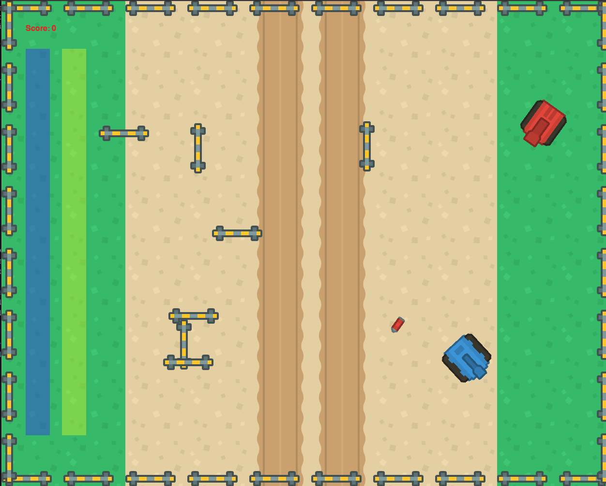

# FIDOH's Tank Game

#### Battle tanks in a 2D environment

### Run the game
1. Ensure that python3 is installed:
`sudo apt install python`
2. Install pygame
`pip install pygame`
3. Launch the game
`python game.py`

### How to Play
- Your goal is to shoot enemy tanks
- Use your mouse cursor to move your tank
- Press Up arrow to speed up
- Press Down arrow to slow down
- Left click the mouse button to shoot

### Additional Features
- You are awarded 100 points for each enemy tank you kill
- If your health bar (red bar) goes to 0, the game ends
- The yellow bar displays your bullet inventory
 
